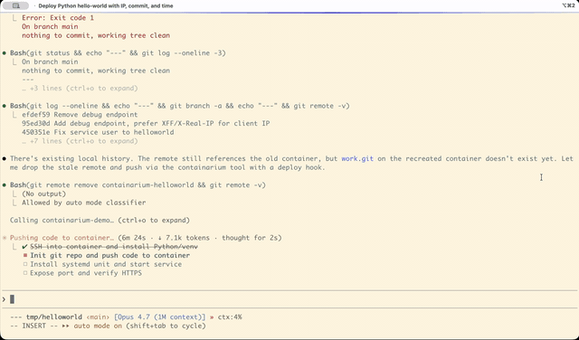

# Containarium

**The open-source, self-hostable, agent-native sandbox.**
Bring your own agent — Cursor, Claude Code, OpenCode, your own MCP client.
We run the box.

```
agent: "create me a sandbox called 'blog'"           → containarium create
agent: "wire up SSH so I can reach it"               → containarium ssh-config sync
agent: "install Caddy on :8080 inside the box"       → shell_exec (via agent-box MCP)
agent: "expose that on blog.example.com"             → containarium expose-port

curl https://blog.example.com → hello world
```

[](LICENSE)
[](go.mod)

[](https://youtu.be/IBDDD_tb8FY)

🌐 **Project site:** [containarium.dev](https://containarium.dev) · 🎬 **55s demo:** [youtu.be/IBDDD_tb8FY](https://youtu.be/IBDDD_tb8FY) · 🚀 **Live app:** [helloworld.demo.containarium.dev](https://helloworld.demo.containarium.dev)

---

## Why "agent-native"?

AI agents are increasingly the primary user of dev infrastructure. They
want to build, install, deploy, and verify — not on the human's laptop
(too noisy, too risky, too local) but on a sandbox that's:

- **Persistent**: state survives between agent runs.
- **Isolated**: a misbehaving install doesn't touch your machine.
- **Real**: a full Linux environment with `systemd`, real networking,
  and the ability to host things on the open internet.
- **Driven by structured tools**: not by an agent typing commands into a
  TTY hoping nothing scrolls off-screen, but by MCP — typed,
  bounded, safe.

That's the box Containarium gives you. It runs as a self-hosted
single-host platform (one VM → many isolated LXC containers), exposes
its admin surface over MCP, and ships a second MCP server that lives
*inside* the container so the agent can `shell_exec` and edit files
directly.

You bring the agent. We run the box.

---

## Quick start

### 1. Self-host on a fresh Ubuntu VM (5 minutes)

```bash
curl -fsSL https://raw.githubusercontent.com/footprintai/containarium/main/hacks/install.sh \
  | sudo bash
```

That installs Containarium + Incus + dependencies, starts the daemon,
and gives you a working API at `http://localhost:8080`.

### 2. Create your first box

```bash
sudo containarium create alice --ssh-key ~/.ssh/id_ed25519.pub
sudo containarium list
```

### 3. Wire up SSH so `ssh alice` just works

```bash
containarium ssh-config sync
# Adds entries to ~/.containarium/ssh_config.
# Then add ONE line to ~/.ssh/config:
#     Include ~/.containarium/ssh_config
ssh alice  # connects through the sentinel
```

### 4. Point your agent at the box

In `~/.cursor/mcp.json` or `~/.claude.json`:

```jsonc
{
  "mcpServers": {
    "containarium-box": {
      "command": "ssh",
      "args": ["alice", "agent-box"]
    }
  }
}
```

Now Claude Code, Cursor, or any MCP-speaking agent can call
`shell_exec`, `read_file`, `write_file`, `list_directory`,
`move_file`, `delete_file` directly inside Alice's container.

### 5. Make it reachable on a public hostname

```bash
containarium expose-port alice \
  --container-port 8080 \
  --domain blog.example.com
```

Caddy on the sentinel terminates TLS for `blog.example.com` and
forwards to `alice-container:8080`. `curl https://blog.example.com`
hits whatever Alice has serving on port 8080.

---

## The four primitives

Every action in Containarium has a CLI verb (canonical) AND an MCP tool
(thin wrapper that delegates to the same Go function). See
[CLAUDE.md](CLAUDE.md) for the convention.

### `agent-box` — in-the-box MCP server

Runs inside every container. Reached over stdio (typically wrapped by
SSH on the client side). Exposes Linux-native operations:

| Tool | What it does |
|---|---|
| `shell_exec` | Run a shell command, capture stdout/stderr/exit, bounded by timeout (default 30s, max 10min) and 256 KiB output cap |
| `read_file` | Byte range OR `head=N` lines OR `tail=N` lines |
| `write_file` | Atomic write with `mkdirp` (temp + rename) |
| `list_directory` | Type/size/mtime, hidden filtering |
| `move_file` | Atomic rename with `mkdirp` on destination |
| `delete_file` | Single-file remove (refuses directories so recursive deletes go via `shell_exec` where blast radius is explicit) |

Resources (read-only data the agent fetches via MCP `resources/read`):

| URI | What it returns |
|---|---|
| `containarium://ci-context` | JSON metadata about the current CI run (PR number, commit SHA, failing test, etc.) when the box was kept alive by the FootprintAI/containarium-run GitHub Action after a failed CI run. Returns `{"available": false}` on non-CI boxes so callers never have to special-case errors. |

Optional sandbox: when `AGENTBOX_ROOT` is set, every file-ops path is
resolved against that root with a boundary-aware prefix check. Default
unset = no constraint. See
[`internal/agentbox/`](internal/agentbox/) for the Go implementation.

### `mcp-server` — platform MCP server

Runs on the host. Exposes outside-the-box admin operations:
`create_container`, `list_containers`, `delete_container`,
`start_container`, `stop_container`, `expose_port`, `get_metrics`,
`get_system_info`. See [`cmd/mcp-server/`](cmd/mcp-server/).

### `containarium` CLI

Same surface as the platform MCP, plus deeper administration. Top-level
verbs:

```
containarium create        Create a new container
containarium list          List all containers
containarium delete        Delete a container
containarium expose-port   Expose container:port on a public hostname
containarium ssh-config    Generate self-contained ssh_config
containarium route         Manage proxy routes (low-level)
containarium passthrough   Manage TCP/UDP passthrough rules
containarium token         Issue JWT tokens for the API
containarium info          System info
containarium version       Print version
```

Run `containarium <verb> --help` for full options.

### Sentinel — sshpiper + Caddy + PROXY-protocol

The sentinel is a tiny always-on VM (e2-micro on GCP free tier works)
that:

- Receives SSH on port 22 (sshpiper routes to the right backend by
  username).
- Receives HTTPS on 443 (Caddy with TLS-passthrough or
  PROXY-protocol-aware forwarding to backend Caddy).
- Survives spot-VM termination on the backend with a maintenance page.
- Holds the static IP / DNS A-record so backends can be ephemeral.

See [docs/SENTINEL-DESIGN.md](docs/SENTINEL-DESIGN.md) for the full
design.

---

## Architecture

```
        Agent (Cursor / Claude Code / OpenCode)
            │
            │ JWT (access; tt=access, jti, scopes)
            │ MCP over stdio  ──┐
            │                   │ ┌── refresh ──> POST /v1/tokens/refresh
            v                   ▼ │                  (single-use; old jti revoked)
        ssh user@box  → sshpiper → agent-box (in container)
            │
            │ HTTPS  (mTLS upstream; PROXY-protocol v2)
            v
        Sentinel (e2-micro, always-on)
        ├── sshpiper (port 22)            : routes by username; fail2ban per-user
        ├── Caddy + PROXY-protocol (443)  : routes by hostname / SNI suffix
        └── /wake/ source-IP allowlist    : trusted-proxy only
            │
            v
        +-------------------------------------------------+
        | Backend VM (spot or bare-metal GPU node)        |
        |                                                 |
        |  Incus (LXC) ── containers                      |
        |    ├── alice-container    : SSH + agent-box     |
        |    │   └── /run/secrets/* : tmpfs, 0440 alice   |
        |    └── bob-container      : ZFS-backed storage  |
        |                                                 |
        |  Containarium daemon                            |
        |    ├── JWT auth (iss/aud/jti/scopes)            |
        |    ├── Admin RBAC + container-owner authz       |
        |    ├── Image-digest gate (REQUIRE + VERIFY)     |
        |    ├── Secrets ── Postgres (envelope-encrypted) |
        |    │              │                             |
        |    │              v                             |
        |    │           KMS ── Vault Transit / GCP KMS   |
        |    │           (master key retirable post-cutover)
        |    └── Audit log ── Postgres + SHA-256 hash     |
        |                     chain (verify CLI)          |
        +-------------------------------------------------+
```

A single sentinel can front multiple backend VMs — a "pool" — and a
single deployment can run multiple pools (each isolated). See
[docs/MULTI-POOL.md](docs/MULTI-POOL.md).

**Security control surface** (all opt-in via env, default-off for
upgrade safety; see [`docs/security/OPERATOR-SECURITY-RUNBOOK.md`](docs/security/OPERATOR-SECURITY-RUNBOOK.md)):

| Env var | Layer | Effect |
| --- | --- | --- |
| `CONTAINARIUM_REQUIRE_IMAGE_DIGEST=true` | API | refuse images without `@sha256:<64hex>` |
| `CONTAINARIUM_VERIFY_IMAGE_DIGEST=true` | API | verify digest against the registry index (pre- + post-pull) |
| `CONTAINARIUM_ALLOWED_IMAGE_REGISTRIES` | API | restrict which simplestreams remotes the daemon will pull from |
| `CONTAINARIUM_KMS_BACKEND={none,inproc,vault,gcp}` | Secrets | envelope-encrypt DEKs through an external KMS |
| `CONTAINARIUM_REQUIRE_ENVELOPE=true` | Secrets | refuse legacy master-key-only rows (Phase E retirement gate) |
| `CONTAINARIUM_POSTGRES_URL_FILE` / `_PASSWORD_FILE` | Secrets | DB creds from disk rather than env |
| `CONTAINARIUM_WAKE_TRUSTED_PROXIES` | Sentinel | source-IP allowlist for `/wake/` |
| `OTEL_BEARER_REQUIRED=true` | Telemetry | collector rejects un-bearered OTLP submissions |

---

## How it's different

### vs. SaaS-only sandboxes (e2b, Modal, Replit)

These give you sandboxes for AI agents, but only as hosted SaaS:

- **Self-hostability**: Containarium runs on your own infrastructure
  (a $5 VM, your homelab, your enterprise data center). e2b, Modal,
  and Replit are SaaS-only — your code, your data, and your customers
  go through their compute.
- **License**: Apache 2.0, no CLA. Fork it, sell it, run it.
- **Surface**: full Linux containers with `systemd`, real network
  namespaces, GPU passthrough. Not a process-per-call sandbox.
- **Transport**: MCP-native from day one, not a custom SDK with MCP
  bolted on.

### vs. dev environment platforms (Codespaces, Gitpod, Coder)

Those are persistent IDEs. Containarium is a persistent **box** —
agent-driven, not developer-driven, no IDE assumption, SSH-as-the-API:

- Containarium environments are reached by SSH and MCP. Any IDE works
  (Vim, JetBrains Remote, VS Code Remote, Cursor's remote dev — your
  call).
- Cost: no per-hour billing in the OSS path. Self-host costs are just
  your underlying VM.
- Persistence: containers survive indefinitely; Codespaces auto-delete
  after inactivity.

### vs. application container platforms (Docker, Kubernetes)

LXC is a **system** container, not an application container. Each
container has `systemd`, a real init, real users, real package managers,
real `sudo`. You can run Docker *inside* a Containarium container; the
reverse isn't really a thing.

If your agent is going to `apt install` half a Linux distro, edit
config files in `/etc`, run a database, and reboot — LXC is the right
shape. If your agent runs a single Python process, Docker or Modal is
fine.

---

## What's in the box

Beyond the agent-native primitives, Containarium ships:

### Multi-OS

- **Ubuntu 24.04 LTS** (default)
- **Rocky Linux 9** (dev/test)
- **RHEL 9** (production)
- **Windows Server VMs** via QEMU/KVM with RDP — see
  [docs/WINDOWS-VM-SETUP.md](docs/WINDOWS-VM-SETUP.md)

### GPU passthrough

For ML/AI agent workflows. Works with NVIDIA RTX 3090, RTX 4090, and
similar. PCI-level passthrough so the container sees the GPU directly.
Tested on bare-metal GPU nodes connected to the sentinel via tunnel.

### Multi-backend

A single sentinel can front:

- **GCP spot VMs**: cost-effective cloud backends with auto-recovery
  on preemption.
- **Bare-metal GPU nodes**: any Linux box you can SSH to; reaches the
  sentinel via outbound tunnel.
- **Windows VMs**: live alongside Linux backends.

All containers from all backends appear in a single unified API.

### Web UI

A basic dashboard at `/webui/` for users who'd rather not type CLI:
container list, lifecycle controls, metrics, browser-based terminal.
Polished UI is intentionally a cloud-product concern — the OSS web UI
is functional, not opinionated.

### Persistent storage (ZFS)

Containers survive VM restarts and spot termination. ZFS handles
compression, snapshots (daily by default, 30-day retention), and
checksums.

### Sentinel HA

The sentinel itself is e2-micro (free tier). It:

- Detects spot preemption in ~10s, serves a maintenance page.
- Restarts spot VMs automatically (~85s total recovery).
- Holds the static IP, so DNS doesn't change as backends rotate.

### Monitoring & observability

VictoriaMetrics + Grafana auto-provisioned. Per-container CPU,
memory, disk, network. Alerting via webhooks. SSH audit logs per
user.

### Security primitives

- **Unprivileged LXC containers**: container root ≠ host root.
- **Per-user proxy accounts**: `/usr/sbin/nologin` on the sentinel,
  users can only proxy through to their container.
- **fail2ban per-user**: an attack on Alice's account doesn't ban
  Bob.
- **ClamAV + Trivy** scanning across all backends.
- **AppArmor profiles** per container.
- **AGENTBOX_ROOT sandbox** to constrain agent-box file ops at runtime.

**Zero-trust controls** (rolled out across the v0.17 → unreleased line; see [`docs/security/OPERATOR-SECURITY-RUNBOOK.md`](docs/security/OPERATOR-SECURITY-RUNBOOK.md)):

- **JWT with `iss` / `aud` / `jti` / `tt` / `scopes`**: 32-byte minimum
  secret enforced at startup; refresh tokens are single-use; jti-based
  revocation; per-tool MCP scopes propagate to server-side gates.
- **Admin RBAC + per-container ownership** on the API surface; cluster
  ops admin-only, container ops owner-only.
- **KMS envelope encryption for tenant secrets** (Vault Transit or GCP
  Cloud KMS), with a migration tool and master-key retirement gate.
- **tmpfs `--delivery=file`** for secrets that shouldn't be visible in
  `/proc/<pid>/environ`.
- **Audit log with SHA-256 hash chain** + `containarium audit verify`
  to detect tampering.
- **Image-registry allowlist + pre-pull simplestreams digest
  verification + post-pull `volatile.base_image` defense-in-depth**
  for supply-chain hardening.
- **`SECURITY.md`** with a 90-day coordinated-disclosure window;
  `gosec` / `govulncheck` / `trivy` running in CI.

---

## CLI reference (essentials)

### Container lifecycle

```bash
# Create (Ubuntu 24.04, default)
containarium create alice --ssh-key ~/.ssh/id_ed25519.pub

# Create with options
containarium create ml-dev \
  --ssh-key ~/.ssh/id_ed25519.pub \
  --gpu 0 \
  --stack gpu \
  --memory 16GB \
  --cpu 4

# Lifecycle
containarium list
containarium info
containarium start alice
containarium stop alice
containarium delete alice
```

### Networking

```bash
# Expose a container port on a public hostname
containarium expose-port alice \
  --container-port 8080 \
  --domain blog.example.com

# Lower-level route management
containarium route add api.example.com --target 10.0.3.42:3000
containarium route list
containarium route delete api.example.com

# Raw TCP/UDP passthrough (no TLS termination)
containarium passthrough add --port 50051 \
  --target-ip 10.0.3.150 --target-port 50051
```

### SSH config

```bash
# Print to stdout (preview)
containarium ssh-config show

# Write to ~/.containarium/ssh_config (one-line `Include` to wire in)
containarium ssh-config sync
containarium ssh-config sync --sentinel sentinel.example.com  # via sentinel
containarium ssh-config sync --identity ~/.ssh/containarium_ed25519
```

### Authentication

```bash
# Issue an access + refresh pair (CLI-only; never exposed via API).
# Access tokens are short-lived (default 15 min) and authenticate the
# API. Refresh tokens are long-lived and single-use — exchange via
# POST /v1/tokens/refresh for a new pair.
containarium token generate \
  --username admin \
  --roles admin \
  --secret-file /etc/containarium/jwt.secret

# Use the access token
curl -H "Authorization: Bearer <access-token>" http://localhost:8080/v1/containers

# Inspect a token's claims (jti, scopes, expiry, validation)
containarium token inspect <token> --secret-file /etc/containarium/jwt.secret

# Revoke a leaked token by jti (idempotent; reads from `audit query`
# or `token inspect`)
containarium token revoke <jti> --reason "leak_2026_05_22"
containarium token list-revoked

# Mint a least-privilege token for an agent with only the scopes it
# needs — server-side gates enforce this even if the agent ignores
# the filter.
containarium token generate \
  --username alice-agent \
  --scopes containers:read,containers:write \
  --secret-file /etc/containarium/jwt.secret
```

See [`docs/security/OPERATOR-SECURITY-RUNBOOK.md`](docs/security/OPERATOR-SECURITY-RUNBOOK.md)
for the full token lifecycle, leak-response playbook, and the agent
least-privilege scope catalog.

---

## Deployment

### Manual install (recommended for getting started)

```bash
curl -fsSL https://raw.githubusercontent.com/footprintai/containarium/main/hacks/install.sh \
  | sudo bash
```

See [`hacks/README.md`](hacks/README.md) for what the script does.

### Terraform (recommended for production)

```bash
cd terraform/gce
cp examples/single-server-spot.tfvars terraform.tfvars
vim terraform.tfvars   # set project_id, admin_ssh_keys, allowed_ssh_sources
terraform init
terraform apply
```

See [`terraform/gce/README.md`](terraform/gce/README.md) for variables.

### System requirements

- **Host OS**: Ubuntu 24.04 LTS or later (containers can be any
  supported OS).
- **Incus 6.19+** required for Docker-in-LXC support. Ubuntu 24.04's
  default repos ship 6.0.0 which has an AppArmor bug
  ([CVE-2025-52881](https://ubuntu.com/security/CVE-2025-52881));
  use the [Zabbly Incus repository](https://pkgs.zabbly.com/) for
  current builds.
- **ZFS kernel module** (for disk quotas).
- Kernel modules: `overlay`, `br_netfilter`, `nf_nat` (Docker in
  containers needs these).

```bash
# Quick Incus install via Zabbly
curl -fsSL https://pkgs.zabbly.com/key.asc | \
  sudo gpg --dearmor -o /usr/share/keyrings/zabbly-incus.gpg
echo 'deb [signed-by=/usr/share/keyrings/zabbly-incus.gpg] \
  https://pkgs.zabbly.com/incus/stable noble main' | \
  sudo tee /etc/apt/sources.list.d/zabbly-incus-stable.list
sudo apt update
sudo apt install incus incus-tools incus-client
incus --version  # 6.19 or later
```

---

## API

Containarium exposes:

- **REST API** at `http://localhost:8080` (gRPC-gateway over the gRPC
  service, JWT auth)
- **gRPC** at `:50051` (mTLS, primarily used by the CLI)
- **Two MCP servers**: `mcp-server` (platform) and `agent-box`
  (in-the-box)

OpenAPI / Swagger UI at
`http://localhost:8080/swagger-ui/`.

Token-issuance is **CLI-only** by design; the daemon does not have an
"issue token via API" endpoint, because if it did, anyone with API
access could mint admin tokens.

---

## Hardening notes

### SSH key hygiene

- Each user gets their own keypair. **Never** share keys between users
  — sharing breaks revocation, audit, and per-user fail2ban.
- The same key can authenticate to both the sentinel proxy account and
  the container. That's the supported flow: simpler for users, no
  security loss because the proxy account is `nologin` and only routes
  through.
- To rotate: user generates a new key, admin replaces the
  `authorized_keys` content in the container.

### Agent-box sandbox

If you're running an untrusted agent, set `AGENTBOX_ROOT` to a project
directory:

```bash
# In the container
export AGENTBOX_ROOT=/srv/project
agent-box   # all file ops now constrained to /srv/project
```

`shell_exec` is intentionally not constrained beyond the LXC container
boundary itself — by design, that's the tool's contract. If you need
tighter isolation, run agent-box in a more restrictive container (e.g.
nested LXC, or chroot the user account further).

### Network

- Backend VMs have **no public IP** by default; they reach out via
  Cloud NAT and accept inbound only via sshpiper.
- Sentinel allowlist: configure `allowed_ssh_sources` in Terraform
  (or firewall rules manually) to lock down who can hit port 22.

---

## Comparison FAQ

**Why not Docker / Podman?**
Docker is for application containers. Containarium uses LXC system
containers — full Linux OS per container, real `systemd`, native SSH,
Docker-in-LXC works, persistent filesystem. If your agent will
`apt install` and reboot, you want LXC.

**Why not Kubernetes?**
K8s orchestrates application containers across many nodes.
Containarium runs many full Linux environments on one (or a few)
nodes. Different shape, different problem.

**Why not Vagrant?**
Vagrant orchestrates VMs on a developer's local machine. Containarium
hosts environments on shared remote infrastructure for many agents.

**Why not Dev Containers / VS Code Remote Containers?**
Dev Containers are project-scoped, IDE-coupled, single-developer.
Containarium gives many users (or many of one user's agents) their own
persistent boxes on shared infrastructure, IDE-agnostic.

**Why not Codespaces / Gitpod?**
Browser-IDE-as-a-Service, per-hour billed, vendor-locked. Containarium
is self-hosted, persistent, SSH/MCP-based, no per-hour billing in OSS.

**Why not e2b / Modal / Daytona?**
Closest peers — sandboxes for AI agents. They're SaaS-only and
typically optimize for short-lived, process-per-call execution.
Containarium is self-hostable, MCP-native, and gives you full
persistent Linux boxes. Pick e2b if you want hosted-only and
ephemeral; pick Containarium if you want self-hosted, persistent,
and your data on your infra.

**Why LXC at all?**
- Each container runs a full Linux OS with `systemd`.
- SSH access is first-class.
- Docker-in-LXC works (vs. fragile Docker-in-Docker).
- Real persistent filesystem, real users, real `sudo`.
- "Feels like a VM" for the agent — same surface area as a managed
  cloud VM, fraction of the resource cost.

---

## Use cases

- **AI-agent sandboxes** (the lead): Cursor, Claude Code, Cline,
  OpenCode, custom agents — all reach the same MCP surface.
- **Shared developer environments**: many developers, one host, SSH
  jump server with per-user isolation.
- **ML / GPU experimentation**: GPU passthrough into LXC.
- **Education, bootcamps, workshops**: per-student isolated Linux
  with no per-student VM.
- **CI / build infrastructure**: long-lived build hosts that keep
  caches warm across runs.
- **Demo / testing infrastructure**: spin up a real Linux env, test,
  tear down.

---

## Status

- **Production-deployed** on GCP (multi-region) and bare-metal GPU
  nodes.
- **APIs are stable** (protobuf-defined with gRPC-gateway).
- **Apache 2.0**, no CLA, accepting community PRs.
- Active maintenance: see commit history on `main` and recent
  releases.

---

## Roadmap

- **Q2 2026 (in flight)**: `agent-box` MCP, `ssh-config` CLI,
  `expose-port` CLI, demo recording.
- **Q3 2026**: `agent-box` tier-2 (MCP Roots, background process
  management), demo-driven docs and examples.
- **Q4 2026**: OSS v1.0 cut — stable API surface, contribution
  guide.

If you want to drive an item, open an issue or PR — community work is
welcome and we triage weekly.

---

## Contributing

- Read [CLAUDE.md](CLAUDE.md) for the CLI-first principle (every new
  platform action lands as `containarium <verb>` first; MCP wraps it).
- Check [existing issues and PRs](https://github.com/footprintai/Containarium/issues).
- Add tests for new features.
- Update docs if user-visible behavior changes.

No CLA. Apache 2.0 means you can use, modify, and redistribute. We
welcome PRs that align with the project's positioning and reject
those that don't (e.g. "let me add multi-tenancy to the OSS daemon"
goes into the cloud repo discussion, not here).

---

## License

Apache License 2.0 — see [LICENSE](LICENSE).

---

## Acknowledgments

- [Incus](https://linuxcontainers.org/incus/) — modern LXC manager.
- [sshpiper](https://github.com/tg123/sshpiper) — SSH reverse proxy.
- [mcp-go](https://github.com/mark3labs/mcp-go) — Go MCP server library.
- [Caddy](https://caddyserver.com/) — TLS / reverse proxy with
  PROXY-protocol support.
- [Cobra](https://cobra.dev/) — CLI framework.
- [Terraform](https://terraform.io/) — infrastructure as code.

---

## Support

- **Project site**: [containarium.dev](https://containarium.dev) — overview, hosted cloud, GitHub Action for CI, PR previews.
- **Documentation**: [docs/](docs/) directory.
- **Issues**: [GitHub Issues](https://github.com/footprintai/Containarium/issues).
- **Demo video**: [55s walkthrough on YouTube](https://youtu.be/IBDDD_tb8FY).
- **Live demo app**: [helloworld.demo.containarium.dev](https://helloworld.demo.containarium.dev).
- **Organization**: [FootprintAI](https://github.com/footprintai).
