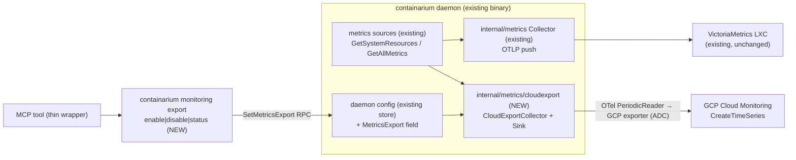

# Design: Cloud-native metrics export (GCP Cloud Monitoring first)

**Date:** 2026-07-23
**Status:** proposed
**Stack:** Go 1.26 + protobuf/gRPC (grpc-gateway) / no frontend component / ships inside the existing daemon binary
**Stories:** #1069 (toggle), #1070 (host series), #1071 (container series), #1072 (heartbeat/dead-man), #1073 (quickstart doc)

## Problem

All daemon metrics terminate in the host-local VictoriaMetrics LXC; alerting
(vmalert) fate-shares with the host it monitors, so a wedged or dead backend
stops being able to report that it is wedged or dead. Operators on GCP/AWS
already run the provider's monitoring and alerting. This feature adds an
**opt-in, out-of-band export** of host + container infra series to the host
cloud's native monitoring (GCP Cloud Monitoring in MVP), authenticated by the
machine's ambient identity (ADC) — no key files, no new monitoring product.

## Design

**One decision up front (the fork the PRD left open): the exporter lives
in-process in the daemon**, not in the core-otelcollector LXC. Reasons:

1. **Dead-man semantics.** #1072's alert must mean "daemon/host is dead." If a
   separate collector LXC did the exporting, its own death would fire the same
   alert (false positive) and its survival could mask a dead daemon until the
   next scrape gap. Daemon-emits ⇒ absence of the series means exactly one thing.
2. **No new deployable.** The daemon already owns metric collection
   (`internal/metrics/otel.go`); the core-otelcollector LXC is an opt-in
   app-telemetry component that is not guaranteed present on every backend.
3. **Typed config.** The toggle becomes a normal proto RPC + daemon config
   field, not YAML surgery on a collector container.

### Components

| Component | Responsibility | Language / location |
|---|---|---|
| `cloudexport.CloudExportCollector` | Own a dedicated OTel `MeterProvider` + `PeriodicReader` wired to a provider `Sink`; register exactly the allowlisted instruments; emit heartbeat | Go, `internal/metrics/cloudexport/collector.go` |
| `cloudexport.Sink` (interface) + `gcpSink` | Provider abstraction: construct the OTel metric exporter for one provider. MVP implements GCP via `opentelemetry-operations-go/exporter/metric`; AWS is a future second implementation | Go, `internal/metrics/cloudexport/{sink.go,gcp.go}` |
| `cloudexport.Sources` (interface) | Seam over the existing collection funcs (`GetSystemResources`, `GetAllMetrics`) so the collector is unit-testable without incus | Go, `internal/metrics/cloudexport/sources.go` |
| `SetMetricsExport` / `GetMetricsExport` RPCs | Typed enable/disable/status; validates provider enum + credential resolvability at enable time | proto + `internal/server/` |
| `containarium monitoring export` subcommand | CLI-first surface; `enable --provider gcp`, `disable`, `status` | Go, `internal/cmd/monitoring_export.go` |
| MCP tool `set_metrics_export` | Thin wrapper over the same client function as the CLI handler | Go, `internal/mcp/tools.go` |
| Quickstart doc | Bare GCP VM → visible metrics + dead-man alert in <10 min, with IAM + cost numbers | `docs/CLOUD-NATIVE-METRICS-EXPORT.md` (#1073) |

### Why a dedicated MeterProvider (not a second reader on the existing one)

The internal Collector exports its full instrument set (system, container,
egress fan-out, backend health…). Cloud-provider custom metrics are **billed
per ingested sample**, so the exported set must be a deliberate allowlist, not
"everything we happen to record." A second `MeterProvider` whose instruments
are exactly the exported series makes the cost surface explicit in code and
reviewable in one file. The collection cost is negligible (the sources are
cheap incus-state reads already performed on a similar cadence).

### Exported series (the complete MVP set — additions require touching this list)

Resource: detected `gce_instance` (GCP resource detector) → series land under
the exporter's workload prefix in Metrics Explorer.

| Series | Kind | Labels (allowlist) |
|---|---|---|
| `containarium.host.cpu.load_1m/_5m/_15m` | gauge | backend_id, hostname, region |
| `containarium.host.memory.used_bytes` / `.total_bytes` | gauge | backend_id, hostname, region |
| `containarium.host.disk.used_bytes` / `.total_bytes` | gauge | backend_id, hostname, region |
| `containarium.host.container.count` | gauge | backend_id, hostname, region |
| `containarium.container.cpu.usage_seconds` | counter | backend_id, container_name |
| `containarium.container.memory.usage_bytes` | gauge | backend_id, container_name |
| `containarium.container.disk.usage_bytes` | gauge | backend_id, container_name |
| `containarium.container.network.rx_bytes` / `.tx_bytes` | counter | backend_id, container_name |
| `containarium.export.heartbeat` | gauge (=1) | backend_id, hostname, daemon_version |

Hard rules: no org/tenant UUID labels ever (reuse the intent of
`DefaultOTelDropLabels`, `internal/server/core_otel_collector.go:45`); interval
fixed default 60s, floor 60s (cost guard); a deleted container's series stop at
the next interval because collection enumerates live containers each tick.

### Data flow, including failure paths

1. Enable: CLI → `SetMetricsExport{provider: GCP}` → server validates enum ≠
   `UNSPECIFIED`/`AWS` (Unimplemented for AWS), **resolves ADC and performs one
   dry-run `CreateTimeSeries`-scope token fetch**; failure returns
   `FailedPrecondition` with the IAM remediation hint and persists nothing.
   Success persists the typed config field and (re)builds the
   `CloudExportCollector`. No daemon restart (mirrors the rebuild pattern used
   elsewhere in the daemon; config write goes through the full-config
   read-modify-write path).
2. Steady state: every interval, the PeriodicReader observes the gauges
   (callbacks pull from `Sources`) and the GCP exporter pushes one
   `CreateTimeSeries` batch.
3. Export failure (quota, IAM revoked, network): the OTel SDK logs and drops;
   we additionally count `export_failures` and surface last-error +
   last-success-time in `GetMetricsExport` status. **Export failure never
   affects daemon operation or the internal VM pipeline** — the two pipelines
   share sources, nothing else.
4. Disable: rebuilds without the reader; emission stops within one interval.
5. Host/daemon death: emission stops ⇒ the operator's metric-absence policy on
   `containarium.export.heartbeat` fires. This is the out-of-band property: no
   component on the host needs to survive for the alert to work.

## Contracts

| Boundary | Contract | Source of truth |
|---|---|---|
| Client ↔ daemon | `SetMetricsExportRequest{provider: CloudMetricsProvider enum, enabled: bool}` / `GetMetricsExportResponse{enabled, provider, interval_seconds, last_success_at, last_error, export_failures}`; RPCs annotated `google.api.http` (`POST /v1/system/metrics-export`, `GET /v1/system/metrics-export`) + openapiv2 descriptions; placed beside the existing Monitoring-tagged RPCs (`service.proto:195-206,601`) | `proto/containarium/v1/service.proto`, regenerated via `make proto` — gRPC, REST, swagger, typed client all derive from it |
| enum | `CloudMetricsProvider { CLOUD_METRICS_PROVIDER_UNSPECIFIED=0; GCP=1; AWS=2 (reserved, Unimplemented) }` — no string provider anywhere | same proto |
| cloudexport ↔ collection | `Sources interface { SystemResources(ctx) (*SystemResources, error); AllContainerMetrics(ctx) (map[string]*pb.ContainerMetrics, error) }` | `internal/metrics/cloudexport/sources.go` |
| cloudexport ↔ provider | `Sink interface { NewExporter(ctx, SinkConfig) (sdkmetric.Exporter, error); Probe(ctx) error }` | `internal/metrics/cloudexport/sink.go` |
| daemon ↔ GCP | Cloud Monitoring v3 `CreateTimeSeries` via `opentelemetry-operations-go/exporter/metric` (NEW dependency); auth = ADC only | vendored module |
| config | typed `MetricsExportConfig{Enabled, Provider, IntervalSeconds}` on the daemon config struct — no map plumbing | daemon config package |

## Test strategy

**`cloudexport` package** (core; no network, no incus):
- Table-driven unit tests with a fake `Sources` and the SDK's in-memory
  manualreader: `TestExportedSeries_MatchesAllowlistGolden` (the exact series
  set + labels above is a golden — any drift fails), `TestNoTenantLabels`
  (inject sources returning org-UUID-looking names → asserted absent from
  labels), `TestDeletedContainerSeriesStop` (source drops a container →
  next observation has no series), `TestHeartbeatEmittedEveryInterval`,
  `TestSourceErrorSkipsTickWithoutPanic`.
- Toggle lifecycle: `TestEnableDisableRebuild` — enable→observe→disable→
  assert reader shutdown and no further observations.
- `gcpSink` contract test against a **fake Cloud Monitoring gRPC server**
  (in-process listener; exporter pointed at it with auth disabled):
  `TestCreateTimeSeriesRequestShape` asserts metric types, gce_instance
  resource mapping, batch cadence, and that a 429 response is dropped-and-
  counted, not retried into the next tick. Real exporter code path; only the
  Google endpoint is fake.
- `TestProbe_ADCMissing` — credential lookup injected; table of (no ADC /
  wrong-scope token / ok) → (FailedPrecondition+hint / FailedPrecondition /
  nil).

**Server RPCs** (`internal/server`): table-driven handler tests mirroring the
existing monitoring-RPC tests — enum validation (UNSPECIFIED → InvalidArgument,
AWS → Unimplemented), probe-failure persists nothing, status round-trip,
admin/tenant scoping consistent with `GetSystemInfo`.

**CLI** (`internal/cmd`): handler tests against the fake typed client (existing
pattern): flag parsing (`--provider gcp`), error rendering of
FailedPrecondition hint, `status` output. MCP correctness follows from the
shared client function (per CLI-first convention) — one smoke test that the
tool routes to it.

**Integration slice** (CI, no cloud account): daemon test harness with fake
Sources + fake Cloud Monitoring server — enable via the real REST gateway path
→ assert TimeSeries arrive; kill the collector → assert heartbeat absence
(this is the automatable proxy for the dead-man alert).

**Live e2e** (manual, release gate — pairs with #1072/#1073 acceptance): on a
real GCP VM: enable → Metrics Explorer shows series ≤2 min → create the
documented absence policy → stop daemon → alert fires. Result recorded in the
quickstart doc.

Mocked vs real: Cloud Monitoring endpoint always faked in CI (real one only in
the manual gate); Sources faked in unit tests, real in the live gate; ADC
resolution real code with injected lookup; incus never mocked at a deeper
layer than `Sources`.

## Deviations from the default stack

- **New dependency**: `github.com/GoogleCloudPlatform/opentelemetry-operations-go/exporter/metric`
  (+ transitive `cloud.google.com/go/monitoring`). Justified: official OTel→GCM
  bridge; hand-rolling `CreateTimeSeries` batching/rate handling is exactly the
  wheel it exists to avoid. Contained: imported only inside
  `internal/metrics/cloudexport/gcp.go`; the rest of the daemon sees the `Sink`
  interface.
- No other deviations: Go, proto-first, grpc-gateway REST, typed config, no
  frontend, no new deployable.

## At 10x

100+ containers/backend ⇒ ~500 container series/backend: still under GCM's
200-series-per-write batch handling (exporter chunks) but cost grows linearly —
the documented cost table in #1073 is per-container-count; if it bites, the
next knob is a per-container export opt-out label, not a redesign. Multi-cloud
(AWS) and tenant-facing cross-project export slot in as new `Sink`
implementations + a credential field on the config message (already an enum,
already an interface).

## Rejected alternatives

1. **otel-collector-contrib (`googlecloudexporter`) inside the
   core-otelcollector LXC.** Rejected: weakens #1072's dead-man semantics (a
   dead collector LXC is indistinguishable from a dead host), the LXC is
   opt-in app-telemetry and not present on every backend, the toggle would be
   collector-YAML mutation instead of a typed RPC, and it ships a ~200MB
   contrib binary for one exporter.
2. **GCP Ops Agent scraping a new daemon Prometheus `/metrics` endpoint.**
   Rejected: introduces a host agent we don't deploy or version, a pull model
   alien to the existing push architecture, and no AWS symmetry (different
   agent, different config language). The daemon deliberately has no
   Prometheus endpoint today — adding one *just* as an agent shim creates a
   second, unauthenticated metrics surface to secure.
3. **VictoriaMetrics-side forwarding (remote-write → GCM).** Rejected: GCM has
   no Prometheus remote-write ingest for custom metrics without an
   intermediary, and it re-introduces the fate-shared hop this feature exists
   to remove.
